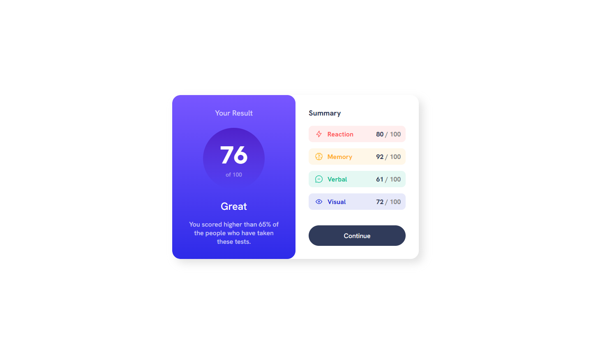
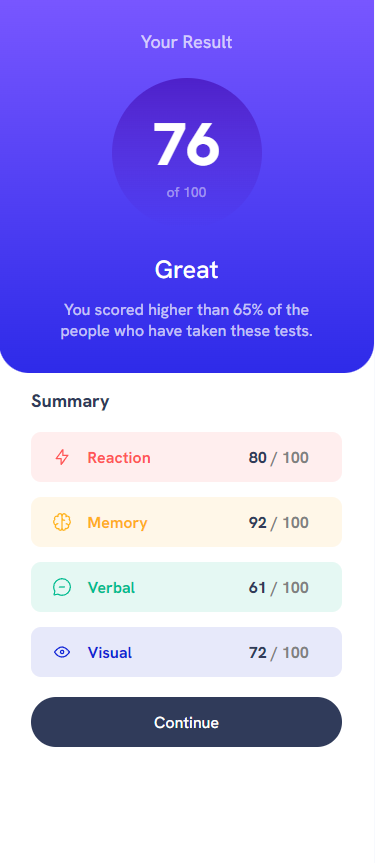

# Frontend Mentor - Results summary component solution

This is a solution to the [Results summary component challenge on Frontend Mentor](https://www.frontendmentor.io/challenges/results-summary-component-CE_K6s0maV). Frontend Mentor challenges help you improve your coding skills by building realistic projects. 

## Table of contents

- [Overview](#overview)
  - [The challenge](#the-challenge)
  - [Screenshot](#screenshot)
  - [Links](#links)
- [My process](#my-process)
  - [Built with](#built-with)
  - [What I learned](#what-i-learned)
  - [Continued development](#continued-development)
- [Author](#author)

## Overview

### The challenge

Users should be able to:

- View the optimal layout for the interface depending on their device's screen size
- See hover and focus states for all interactive elements on the page
- **Bonus**: Use the local JSON data to dynamically populate the content

### Screenshot

### Links

- Live Site URL: [Results Summary Component](https://rkendall300.github.io/results-summary-component/)

## My process

### Built with

- Semantic HTML5 markup
- CSS custom properties
- Flexbox
- CSS Grid

### What I learned

This was my first project using grid instead of flexbox, but I only ended up using grid for the summary items rather than the whole layout. The way my brain works now is by using flex primarily, so all the other elements I used flex since I knew they would work. However, using grid for the summary elements was pretty easy, and I know I'll need to use it in the future so this was pretty helpful. Also learned some cool new tricks with hsla for transparency of the colors. Overall, very nice design and easy to work with.

### Continued development

I plan to come back to this project once I'm more comfortable parsing JSON data and will incorporate it into the results summaries. 

## Author

- Frontend Mentor - [@rkendall300](https://www.frontendmentor.io/profile/rkendall300)